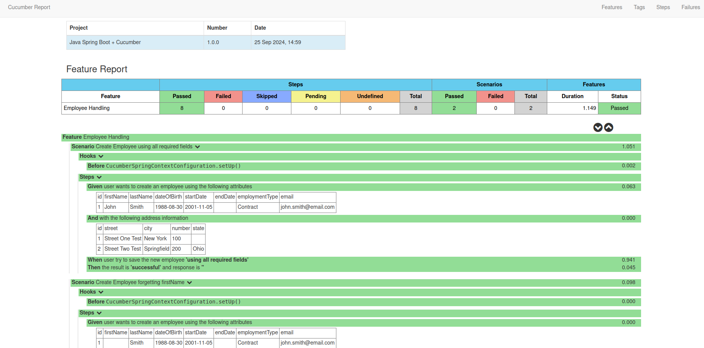

# Java Spring Boot + Cucumber
Simple repository to demonstrate Java Spring Boot + Cucumber

### Specification

- Java 8
- Spring Boot 2.1.5.RELEASE
- Cucumber 4.2.0

### Overview

This repository uses the Cucumber Report to pretty show the results in Html format as shown below

There are two kind of tests

- Using Feature file specification

<pre>
# language: en

Feature: Employee Handling

    Scenario: Create Employee using all required fields

      Given user wants to create an employee using the following attributes
        | id | firstName | lastName | dateOfBirth | startDate  | endDate | employmentType | email                |
        |  1 | John      | Smith    | 1988-08-30  | 2001-11-05 |         | Contract       | john.smith@email.com |

      And with the following address information
        | id | street          | city        | number | state |
        |  1 | Street One Test | New York    |    100 |       |
        |  2 | Street Two Test | Springfield |    200 | Ohio  |

      When user try to save the new employee 'using all required fields'
      Then the result is 'successful' and response is ''

    Scenario: Create Employee forgetting firstName

      Given user wants to create an employee using the following attributes
        | id | firstName | lastName | dateOfBirth | startDate  | endDate | employmentType | email                |
        |  1 |           | Smith    | 1988-08-30  | 2001-11-05 |         | Contract       | john.smith@email.com |

      And with the following address information
        | id | street          | city        | number | state |
        |  1 | Street One Test | New York    |    100 |       |
        |  2 | Street Two Test | Springfield |    200 | Ohio  |

      When user try to save the new employee 'using all required fields'
      Then the result is 'failure' and response is 'create.employeeDTO.firstName: must not be empty'
</pre>

- Using Cucumber Runner Tests

> For Cucumber simple result

<code>

    package com.huntercodexs.cucumberdemo.employee.bdd;
    
    import cucumber.api.CucumberOptions;
    import cucumber.api.junit.Cucumber;
    import org.junit.runner.RunWith;
    
    @RunWith(Cucumber.class)
    @CucumberOptions(
        features = "classpath:features",
        plugin = {"pretty", "json:target/cucumber-report.json"}
    )
    public class CucumberRunnerTest {
    }

</code>

> For Cucumber Html Report format

<code>

    package com.huntercodexs.cucumberdemo.employee.bdd;
    
    import com.huntercodexs.cucumberdemo.employee.bdd.report.CucumberReport;
    import cucumber.api.CucumberOptions;
    import org.junit.runner.RunWith;
    
    @RunWith(CucumberReport.class)
    @CucumberOptions(
        features = "classpath:features",
        plugin = {"pretty", "json:target/cucumber-report.json"}
    )
    public class CucumberReportRunnerTest {
    }

</code>
